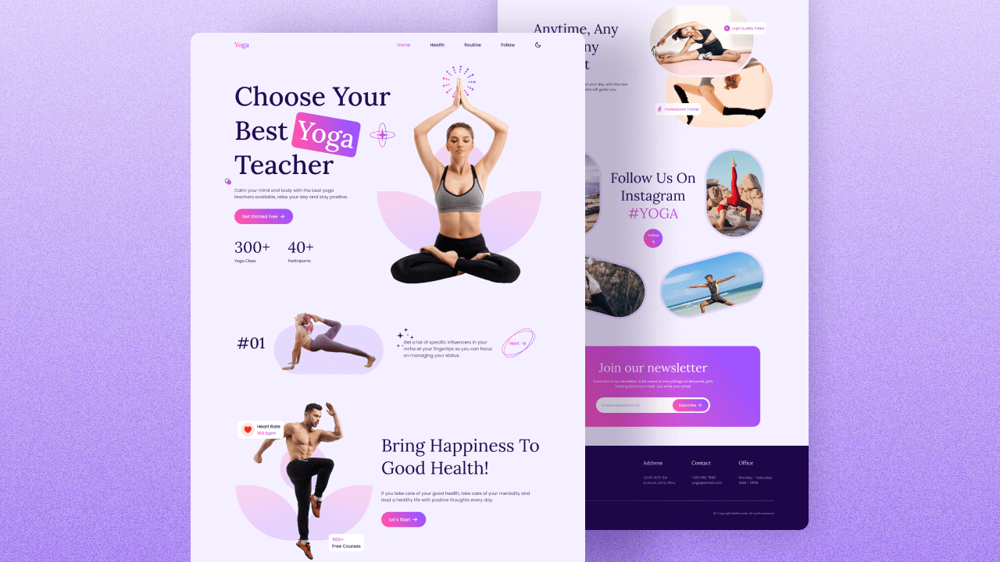

  
  
  
  

   
   
  

  <h2 align="center">Arch - Yoga website</h2>

  Arch is a fully responsive yoga website page,  Responsive for all devices, built using HTML, CSS, and JavaScript.

   <a href="https://adnan-bhaldar.github.io/Arch-Yoga/"><strong>➥ Live Demo</strong></a>

 

### Demo Screeshots

### Responsive Yoga Website

- Responsive Yoga Website Design Using HTML CSS & JavaScript
- Contains animations when scrolling.
- Smooth scrolling in each section.
- Includes a dark & light theme.
- Developed first with the Mobile First methodology, then for desktop.
- Compatible with all mobile devices and with a beautiful and pleasant user interface.

### Contact

If you want to contact with me you can reach me at [Twitter](https://www.twitter.com/Adnan__Bhaldar).

### License

This project is **free to use** and does not contains any license.
